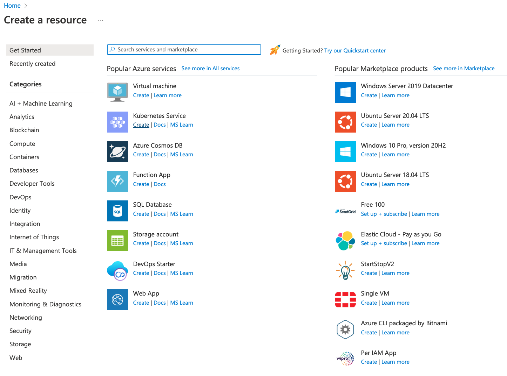
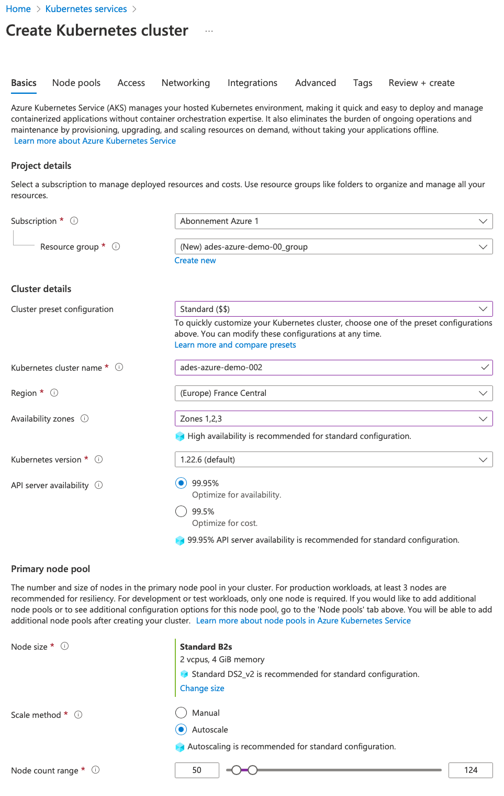

# Before you start

Before you start executing commands to setup the ADES platform on your Microsoft Azure Kubernetes Cluster, you should first create the target Kubernetes cluster.

To do so please follow this short guide to setup the Kubernetes cluster in such a way that the execution will work.

## Create a new Kubernetes resource

First go on http://portal.azure.com and click on create a new resource. The click on create in the Kubernetes section.

## Kubernetes cluster parameters

### Basics

In the "Basics" tab, define a cluster name and select Standard in the preset configuration. As this demonstration does not require a lot of computing resources, select "Standard B2s" with 2 vcpus and, 4GiB memory in the "Node size". Select node range as shown in the screenshot below (min: 50, max: 124)

There is no modification needed for any other step. So, you can click on "Review + create" button to create the Kubernetes cluster.
